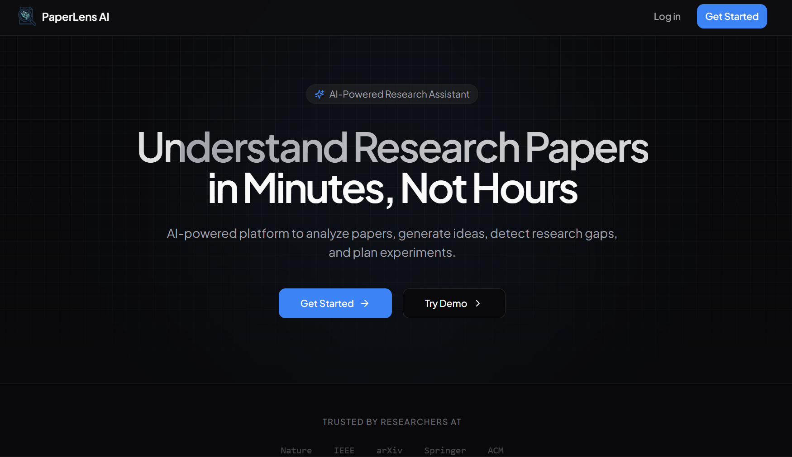

# PaperLens AI

<p align="center">
  
</p>

<p align="center">
  <b>Turn research papers into insights, plans, and ideas.</b>
</p>

<p align="center">
  
  
  
  
</p>

PaperLens AI is a full-stack research assistant that helps you analyze papers, ask grounded questions, detect gaps, and generate experiment plans or research problem statements.

## ✨ Highlights

- **Paper Analyzer**: Upload PDF/DOCX, get structured analysis, and chat with document context.
- **Gap Detection**: Find missing opportunities from project text or uploaded papers.
- **Experiment Planner**: Generate actionable, step-wise research execution plans.
- **Problem Generator**: Create domain-aware research ideas with complexity control.
- **Dashboard Metrics**: Track analyzed papers and activity stats.

## 🧱 Architecture

- **Frontend**: React + Vite + TypeScript + Tailwind + shadcn/ui
- **Backend**: FastAPI + SQLAlchemy + Hybrid RAG (FAISS + BM25)
- **Auth**: Clerk JWT-based API auth
- **Data**: PostgreSQL (Supabase compatible)
- **LLM**: Groq

```text
paper_explainer/
├─ backend/
├─ frontend/
├─ docs/
├─ render.yaml
├─ vercel.json
└─ README.md
```

## 🚀 Quick Start

### Prerequisites

- Python 3.10+
- Node.js 18+
- Clerk account
- PostgreSQL URL
- Groq API key

### 1) Backend

```powershell
cd backend
python -m venv .venv
.venv\Scripts\Activate.ps1
pip install -r requirements.txt
```

Create `backend/.env`:

```env
DATABASE_URL=postgresql://...
CLERK_SECRET_KEY=sk_...
GROQ_API_KEY=gsk_...
```

Run:

```powershell
uvicorn app.main:app --reload
```

### 2) Frontend

```powershell
cd frontend
npm install
```

Create `frontend/.env.local`:

```env
VITE_CLERK_PUBLISHABLE_KEY=pk_test_...
VITE_API_URL=http://localhost:8000
```

Run:

```powershell
npm run dev
```

## 🔌 API Snapshot

Public:
- `GET /health`

Protected:
- `GET /api/test-auth`
- `GET /api/dashboard`
- `GET /api/documents`
- `POST /api/analyze`
- `POST /api/analyze_stream`
- `POST /api/ask`
- `POST /api/ask_stream`
- `POST /api/plan-experiment`
- `POST /api/generate-problems`
- `POST /api/detect-gaps`

See full contracts in `docs/API_REFERENCE.md`.

## 🌍 Deployment

- **Backend**: Render (`render.yaml`)
- **Frontend**: Vercel (`vercel.json`)

## 📚 Docs

- Project analysis: `docs/PROJECT_ANALYSIS.md`
- API reference: `docs/API_REFERENCE.md`
- Backend guide: `backend/README.md`
- Frontend guide: `frontend/README.md`

## 📄 License

MIT License. See `LICENSE`.
