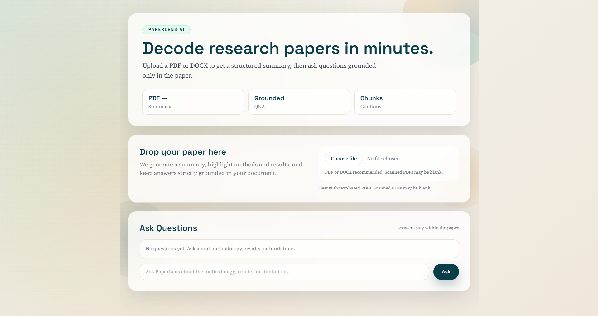

# PaperLens AI

PaperLens AI is a research paper explainer built with React and FastAPI. Upload a PDF or DOCX, get a structured AI-generated analysis, and ask follow-up questions grounded in the document content.

It is designed for fast academic reading workflows where you want the key idea, methodology, results, limitations, and future work without manually digging through every section first.



## Highlights

- Upload research papers in PDF or DOCX format
- Generate structured markdown analysis in the UI
- Ask follow-up questions against the uploaded document
- Use hybrid retrieval with semantic search and BM25
- Improve relevance with cross-encoder reranking
- Reuse document state with hash-based in-memory caching
- Stream analysis and answers for a more responsive experience

## Tech Stack

| Layer | Tools |
|---|---|
| Frontend | React 19, Vite 8, Tailwind CSS, react-markdown, remark-gfm |
| Backend | FastAPI, Uvicorn, Groq API |
| Retrieval | sentence-transformers, FAISS, rank-bm25, CrossEncoder |
| Parsing | pdfplumber, python-docx |

## How It Works

1. The frontend uploads a document to the FastAPI backend.
2. The backend extracts text from PDF or DOCX.
3. The text is split into overlapping semantic chunks.
4. Dense embeddings and a BM25 index are created.
5. Relevant chunks are reranked before being used for analysis or Q and A.
6. The model returns structured markdown analysis and grounded answers.

## Repository Structure

```text
paper_explainer/
|-- backend/
|   |-- app/
|   |   |-- api/
|   |   |-- core/
|   |   |-- models/
|   |   `-- services/
|   |-- .env.example
|   |-- requirements.txt
|   `-- README.md
|-- frontend/
|   |-- public/
|   |-- src/
|   |-- .env.example
|   |-- package.json
|   `-- README.md
|-- .gitignore
|-- README.md
|-- WORKFLOW.md
`-- requirements.txt
```

## Quick Start

### Backend

```powershell
cd backend
python -m venv .venv
.venv\Scripts\Activate.ps1
pip install -r requirements.txt
Copy-Item .env.example .env
```

Set your Groq API key in `backend/.env`, then start the server:

```powershell
uvicorn app.main:app --reload
```

Backend URL:

- http://localhost:8000

### Frontend

```powershell
cd frontend
npm install
Copy-Item .env.example .env
npm run dev
```

Frontend URL:

- http://localhost:5173

## Environment Variables

### Backend

- GROQ_API_KEY
- GROQ_MODEL
- EMBEDDING_MODEL
- RERANKER_MODEL
- UPLOAD_FOLDER
- CHUNK_SIZE
- CHUNK_OVERLAP
- TOP_K

### Frontend

- VITE_API_URL

## API Endpoints

- GET /health
- POST /api/analyze
- POST /api/analyze_stream
- POST /api/ask
- POST /api/ask_stream

The upload field name for analysis endpoints is `file`.

## Documentation

- See [WORKFLOW.md](WORKFLOW.md) for the full processing pipeline.
- See [DEPLOYMENT.md](DEPLOYMENT.md) for prototype cloud deployment with Vercel and Render.
- See [backend/README.md](backend/README.md) for backend setup and API details.
- See [frontend/README.md](frontend/README.md) for frontend setup and scripts.

## Current Limitations

- Cache is in memory only and resets when the backend restarts.
- Scanned PDFs without extractable text are not handled well yet.
- There is no authentication or per-user document isolation.
- Large papers may take longer because indexing and analysis happen inside the request flow.

## Migration Note

This project started with Flask and was later migrated to FastAPI plus React. The active runtime is now the FastAPI backend in `backend/app` and the React frontend in `frontend`.