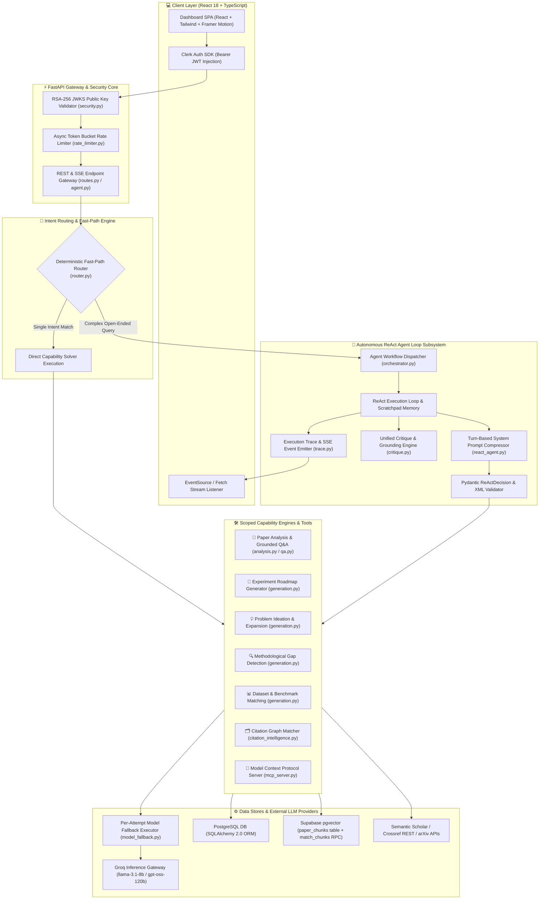
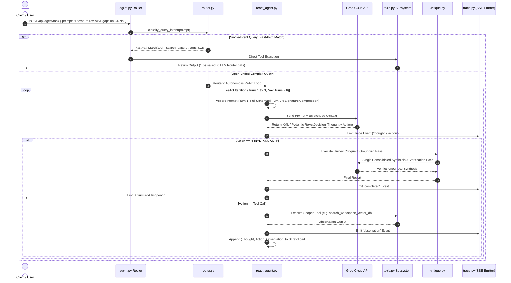

# 🏗 System Architecture & Autonomous ReAct Engine

This document provides a deep architectural breakdown of **PaperLens AI**, covering the end-to-end system topology, dual RAG pipelines, the autonomous ReAct agent loop, and recent token and latency optimization passes.

---

## 1. End-to-End System Architecture

PaperLens AI follows a decoupled, asynchronous client-server architecture designed for high-concurrency LLM processing, vector retrieval, and low-memory execution:



---

## 2. The Autonomous ReAct Agent Subsystem

The flagship component of PaperLens AI is its autonomous ReAct (Reason + Act) agent loop located in [`backend/app/services/agents/`](file:///d:/Edutation(P)/Learning-code/paper_explainer/backend/app/services/agents).

### ReAct Agent Execution Sequence



---

## 3. Core Architectural Modules Explained

### A. Fast-Path Router (`router.py`)
- **File**: [`backend/app/services/agents/router.py`](file:///d:/Edutation(P)/Learning-code/paper_explainer/backend/app/services/agents/router.py)
- **Function**: Examines incoming user prompts against deterministic regex patterns for direct tool invocation (e.g., matching `"find datasets for X"` $\rightarrow$ `find_datasets`, `"search papers on Y"` $\rightarrow$ `search_papers`).
- **Architectural Impact**: Skips the initial LLM intent resolution call entirely for single-intent tasks, cutting **1.5 seconds of latency** and **~600 prompt tokens** per call.

### B. ReAct Execution Loop & Prompt Compression (`react_agent.py`)
- **File**: [`backend/app/services/agents/react_agent.py`](file:///d:/Edutation(P)/Learning-code/paper_explainer/backend/app/services/agents/react_agent.py)
- **Function**: Manages turn state, scratchpad history, tool selection, and tool execution loop.
- **Architectural Impact**: Implements **Turn-Based System Prompt Compression**:
  - **Turn 1**: Injects full JSON schemas for selected tools so the model understands signature syntax.
  - **Turns 2–6**: Replaces verbose JSON schemas with lightweight signature tags (`ACTIVE TOOLS: search_papers(domain, limit)`), reducing prompt context size by **~40% on turns 2–6**.

### C. Task-Specific Tool Scoping (`tools.py`)
- **File**: [`backend/app/services/agents/tools.py`](file:///d:/Edutation(P)/Learning-code/paper_explainer/backend/app/services/agents/tools.py)
- **Function**: Scopes available agent tools dynamically based on user prompt context while ensuring `search_papers` is permanently retained as a safety guardrail.
- **Architectural Impact**: Prevents tool starvation and reduces context noise by providing only relevant execution options.

### D. Consolidated Synthesis & Critique (`critique.py` & `planner.py`)
- **Files**: [`backend/app/services/agents/critique.py`](file:///d:/Edutation(P)/Learning-code/paper_explainer/backend/app/services/agents/critique.py), [`backend/app/services/agents/planner.py`](file:///d:/Edutation(P)/Learning-code/paper_explainer/backend/app/services/agents/planner.py)
- **Function**: Evaluates agent scratchpad results, performs peer-review verification against uploaded papers/literature, and formats the final markdown report.
- **Architectural Impact**: Combines what was previously two separate LLM calls (Peer-Review Critique + Final Markdown Synthesis) into a **single consolidated execution pass**, driving a **54.5% total reduction in LLM API calls**.

---

## 4. Dual RAG Pipeline Architecture

PaperLens AI maintains two distinct Retrieval-Augmented Generation (RAG) pipelines optimized for different execution requirements:

```
                  ┌─────────────────────────────────────────┐
                  │          Uploaded PDF Document          │
                  └────────────────────┬────────────────────┘
                                       │
                    ┌──────────────────┴──────────────────┐
                    ▼                                     ▼
      ┌───────────────────────────┐         ┌───────────────────────────┐
      │ Legacy In-Memory Pipeline │         │  Persistent pgvector RAG │
      │  (POST /api/analyze)      │         │ (POST /api/upload-paper)  │
      └─────────────┬─────────────┘         └─────────────┬─────────────┘
                    │                                     │
   ┌────────────────┴────────────────┐   ┌────────────────┴────────────────┐
   │ 1. PyMuPDF Generator Parsing    │   │ 1. PyMuPDF Generator Parsing    │
   │ 2. SHA256 deterministic doc_id │   │ 2. tiktoken 512-Token Chunker   │
   │ 3. Sentence Boundary Windowing  │   │ 3. all-MiniLM-L6-v2 Embeddings  │
   │ 4. Rank-BM25 + FAISS Index      │   │ 4. Supabase pgvector Insert     │
   │ 5. In-Memory Process Cache      │   │ 5. RPC match_chunks Search      │
   └────────────────┬────────────────┘   └────────────────┬────────────────┘
                    │                                     │
                    ▼                                     ▼
        Instant Single-Session Q&A              Multi-Session Map-Reduce
          (Zero Database Storage)                Persistent Summaries
```

1. **Legacy In-Memory Pipeline (`doc_id`)**:
   - Designed for instant single-session paper analysis without database writes.
   - Derives `doc_id` deterministically from `SHA256(filename:size)[:12]`.
   - Uses `Rank-BM25` for lexical search and local `FAISS-CPU` (`IndexFlatL2`) for vector matching in process memory [`cache.py`](file:///d:/Edutation(P)/Learning-code/paper_explainer/backend/app/services/cache.py).

2. **Persistent Supabase pgvector Pipeline (`paper_id`)**:
   - Designed for multi-session paper management and persistent Map-Reduce summaries.
   - Uses `tiktoken` to split documents into 512-token chunks, embeds them via `all-MiniLM-L6-v2`, and upserts 384-dimensional vectors into Supabase's `paper_chunks` PostgreSQL table.
   - Executes similarity searches via the `match_chunks` RPC function in [`qa.py`](file:///d:/Edutation(P)/Learning-code/paper_explainer/backend/app/services/llm_sections/qa.py).
