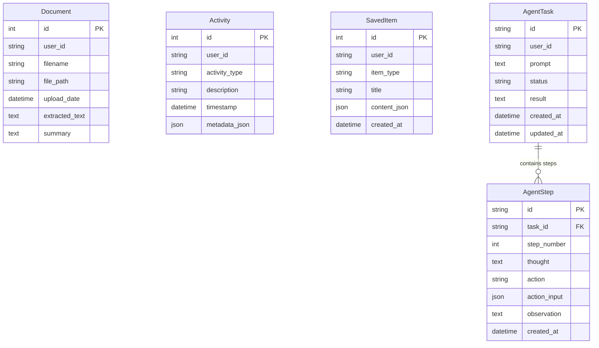

# 🗄 Database Schema & Vector Retrieval Architecture

This document specifies the database architecture for **PaperLens AI**, covering relational PostgreSQL tables, Supabase `pgvector` dense embedding storage, RPC matching algorithms, and the in-memory hybrid search index.

---

## 1. Relational Database Schema (PostgreSQL)

PaperLens AI uses **SQLAlchemy 2.0 ORM** models located in [`backend/app/models/domain.py`](file:///d:/Edutation(P)/Learning-code/paper_explainer/backend/app/models/domain.py) and [`agent_task.py`](file:///d:/Edutation(P)/Learning-code/paper_explainer/backend/app/models/agent_task.py), managed via **Alembic** schema migrations.

### Entity-Relationship Diagram (ERD)



---

## 2. Table Specifications

### A. `documents` Table
Stores metadata for uploaded papers (PDF/DOCX) processed by the system.
- **ORM Model**: [`Document`](file:///d:/Edutation(P)/Learning-code/paper_explainer/backend/app/models/domain.py#L7-L17)
- **Columns**:
  - `id` (`Integer`, Primary Key, Autoincrement)
  - `user_id` (`String`, Indexed): Clerk User ID owning the document.
  - `filename` (`String`): Original filename.
  - `file_path` (`String`): Local or server storage path.
  - `upload_date` (`DateTime`): Timestamp of document upload.
  - `extracted_text` (`Text`, Nullable): Raw text extracted via PyMuPDF.
  - `summary` (`Text`, Nullable): Generated document summary.

### B. `activities` Table
Tracks user workflow actions for dashboard metrics and history.
- **ORM Model**: [`Activity`](file:///d:/Edutation(P)/Learning-code/paper_explainer/backend/app/models/domain.py#L20-L29)
- **Columns**:
  - `id` (`Integer`, Primary Key, Autoincrement)
  - `user_id` (`String`, Indexed): Clerk User ID.
  - `activity_type` (`String`): Activity type (e.g. `paper_analysis`, `experiment_plan`, `gap_detection`).
  - `description` (`String`): Human-readable activity title.
  - `timestamp` (`DateTime`): Time of activity execution.
  - `metadata_json` (`JSON`, Nullable): Extra contextual details.

### C. `saved_items` Table
Stores user-bookmarked items (problem briefs, experiment roadmaps, citation lists).
- **ORM Model**: [`SavedItem`](file:///d:/Edutation(P)/Learning-code/paper_explainer/backend/app/models/domain.py#L32-L41)
- **Columns**:
  - `id` (`Integer`, Primary Key, Autoincrement)
  - `user_id` (`String`, Indexed): Clerk User ID.
  - `item_type` (`String`): Saved item type category.
  - `title` (`String`): User-defined title.
  - `content_json` (`JSON`): Arbitrary JSON payload of saved data.
  - `created_at` (`DateTime`): Creation timestamp.

### D. `agent_tasks` Table
Tracks execution states of autonomous ReAct agent tasks.
- **ORM Model**: [`AgentTask`](file:///d:/Edutation(P)/Learning-code/paper_explainer/backend/app/models/agent_task.py#L9-L21)
- **Columns**:
  - `id` (`String(36)`, Primary Key): UUID task identifier.
  - `user_id` (`String(255)`, Indexed): Clerk User ID.
  - `prompt` (`Text`): User's original research task prompt.
  - `status` (`String(50)`): Task state (`running`, `completed`, `failed`).
  - `result` (`Text`, Nullable): Final generated report.
  - `created_at` (`DateTime`), `updated_at` (`DateTime`)

### E. `agent_steps` Table
Stores individual thought-action-observation steps within an agent task.
- **ORM Model**: [`AgentStep`](file:///d:/Edutation(P)/Learning-code/paper_explainer/backend/app/models/agent_task.py#L24-L39)
- **Columns**:
  - `id` (`String(36)`, Primary Key): UUID step identifier.
  - `task_id` (`String(36)`, Foreign Key $\rightarrow$ `agent_tasks.id`): Parent task ID.
  - `step_number` (`Integer`): Iteration index (1 to N).
  - `thought` (`Text`, Nullable): Agent reasoning output.
  - `action` (`String(100)`, Nullable): Tool name invoked.
  - `action_input` (`JSON`, Nullable): Tool call arguments.
  - `observation` (`Text`, Nullable): Output returned by tool.
  - `created_at` (`DateTime`)

---

## 3. Vector Database Architecture (Supabase pgvector)

Persistent paper chunk embeddings are stored in Supabase using the `pgvector` PostgreSQL extension. The DDL script is located in [`backend/supabase_migration.sql`](file:///d:/Edutation(P)/Learning-code/paper_explainer/backend/supabase_migration.sql).

### `paper_chunks` Table Definition
```sql
CREATE EXTENSION IF NOT EXISTS vector;

CREATE TABLE IF NOT EXISTS paper_chunks (
    id UUID PRIMARY KEY DEFAULT gen_random_uuid(),
    paper_id TEXT NOT NULL,
    chunk_index INT NOT NULL,
    content TEXT NOT NULL,
    embedding vector(384),
    metadata JSONB DEFAULT '{}'::jsonb,
    created_at TIMESTAMP WITH TIME ZONE DEFAULT NOW()
);

CREATE INDEX IF NOT EXISTS paper_chunks_paper_id_idx ON paper_chunks (paper_id);
```

### `match_chunks` RPC Similarity Search Algorithm
```sql
CREATE OR REPLACE FUNCTION match_chunks (
  query_embedding vector(384),
  match_count int DEFAULT 5,
  filter_paper_id text DEFAULT NULL
)
RETURNS TABLE (
  id UUID,
  paper_id TEXT,
  chunk_index INT,
  content TEXT,
  similarity float
)
LANGUAGE plpgsql
AS $$
BEGIN
  RETURN QUERY
  SELECT
    paper_chunks.id,
    paper_chunks.paper_id,
    paper_chunks.chunk_index,
    paper_chunks.content,
    1 - (paper_chunks.embedding <=> query_embedding) AS similarity
  FROM paper_chunks
  WHERE (filter_paper_id IS NULL OR paper_chunks.paper_id = filter_paper_id)
  ORDER BY paper_chunks.embedding <=> query_embedding
  LIMIT match_count;
END;
$$;
```

---

## 4. In-Memory Hybrid Search (BM25 + FAISS)

For legacy instant paper analysis (`POST /api/analyze`), PaperLens AI bypasses database writes and builds an in-memory index cached in [`backend/app/services/cache.py`](file:///d:/Edutation(P)/Learning-code/paper_explainer/backend/app/services/cache.py):

1. **Document Keying**: Keyed deterministically by `SHA256(filename:size)[:12]`.
2. **Lexical Keyword Index**: Built using `rank_bm25.BM25Okapi` over sentence tokens.
3. **Dense Vector Index**: Built using `faiss.IndexFlatL2(384)` over `all-MiniLM-L6-v2` embeddings.
4. **Hybrid Rank Fusion**: Q&A queries score chunks by combining normalized BM25 keyword matching with FAISS L2 vector distance to retrieve high-precision grounded contexts.
