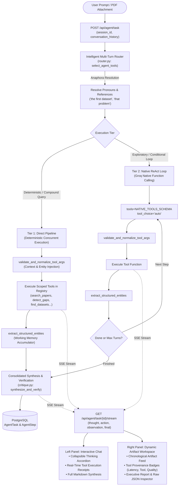

# 🤖 Agent Mode — Autonomous Multi-Agent Research Workbench

> **PaperLens AI Autonomous Agent System**: An enterprise-grade, framework-free research orchestrator that routes user prompts to specialized academic intelligence tools, manages structured working memory across multi-turn sessions, and streams real-time step traces to an interactive research workbench.

---

## 1. System Overview & Request Lifecycle

Agent Mode enables automated academic discovery, literature synthesis, research gap detection, problem formulation, dataset benchmark evaluation, and experimental roadmap planning.

### Architecture Flowchart



---

## 2. Core Architectural Pillars

### A. Two-Tier Execution Strategy
To minimize LLM token overhead and request latency, the orchestrator implements a **Two-Tier Routing Pipeline**:

| Execution Tier | Trigger Condition | Mechanism | Latency Profile |
| :--- | :--- | :--- | :--- |
| **Tier 1: Direct Execution Pipeline** | Unambiguous single/compound tool intents (e.g. *"Find benchmark datasets AND problem directions for brain tumors"*). | Fast-path classifier / single routing LLM call directly executes tools in sequence/parallel, bypassing turn-by-turn re-planning. | **~9.9s** (60–75% faster, 1–2 LLM calls total). |
| **Tier 2: Native Tool ReAct Loop** | Open-ended, exploratory goals requiring iterative discovery where next steps depend on prior observations. | Native OpenAI/Groq function calling (`tools=NATIVE_TOOLS_SCHEMA`, `tool_choice="auto"`) with self-healing retry logic. | **~25–35s** (Full multi-turn reasoning trace). |

### B. Session-Aware Multi-Turn State & Anaphora Resolution
- **Session Continuity**: `AgentTask` persists a persistent `session_id` and structured `context_data` in PostgreSQL.
- **Context Injection**: Frontend client forwards the last $k=4$ conversation turns (`conversation_history`).
- **Pronoun & Reference Resolution**: When users submit follow-up prompts (e.g., *"Compare the first dataset to TCIA"* or *"Design an experiment for that problem"*), `router.py` automatically extracts specific entities from prior turn outputs to build fully qualified tool execution arguments.

### C. Structured Working Memory & Cross-Tool Context Propagation
Crude string truncations (such as slicing tool text to 150 characters) are replaced with **Typed Semantic Entity Extraction**:

```python
# Semantic entities extracted into task working memory
structured_memory = {
    "primary_papers": [{"title": "...", "authors": [...], "year": 2024, "summary": "..."}],
    "identified_gaps": [{"gap": "Lack of 3D dynamics", "description": "...", "opportunity": "..."}],
    "formulated_problems": [{"title": "...", "description": "...", "gap_addressed": "..."}],
    "suggested_datasets": [{"name": "BraTS 2023", "type": "MRI", "metrics": "..."}],
    "execution_stages": [{"phase": "Stage 1", "focus": "...", "deliverable": "..."}]
}
```

- **Automatic Argument Inheritance**: When subsequent tools run (e.g., `generate_problem` after `detect_gaps`), `validate_and_normalize_tool_args` automatically inherits unprovided arguments from `structured_memory` (e.g., populating `gap_summary` with identified domain gaps).

### D. Anti-Hallucination & Error Recovery Guardrails
- **Self-Healing Re-Prompting**: If an unregistered tool is hallucinated by the model, the system re-prompts the model with strict schema validation without crashing the session.
- **Availability Fallbacks**: When external academic data sources (such as Semantic Scholar or arXiv APIs) rate-limit or fail, the tool emits a structured `"status": "unavailable"` response. The downstream synthesizer enforces an **Unavailability Directive** preventing fabricated citations or fake metrics.

---

## 3. Scoped Tool Registry

The orchestrator registers 7 specialized academic tools in [`tools.py`](file:///d:/Edutation(P)/Learning-code/paper_explainer/backend/app/services/agents/tools.py):

| Tool Identifier | Function Name | Core Capability | Output Schema |
| :--- | :--- | :--- | :--- |
| `search_papers` | `search_papers(domain, limit)` | Queries Semantic Scholar and arXiv APIs for peer-reviewed publications. | `{"papers": [{title, authors, year, summary, citation_count, venue}]}` |
| `search_workspace_vector_db` | `search_workspace_vector_db(query, paper_id)` | Performs dense cosine similarity search over indexed PDF embeddings in pgvector. | `{"results": [{chunk_id, content, similarity_score, page}]}` |
| `analyze_paper` | `analyze_paper(text, paper_id)` | Extracts methodology, architectural contributions, and experimental baselines. | `{"methodology": "...", "contributions": [...], "limitations": [...]}` |
| `detect_gaps` | `detect_gaps(domain, paper_id)` | Identifies unexplored research opportunities, clinical/computational bottlenecks. | `{"domain": "...", "gaps": [{gap, description, opportunity}]}` |
| `generate_problem` | `generate_problem(domain, gap_summary)` | Formulates novel problem statements with step-by-step methodologies and metrics. | `{"problems": [{title, problem_statement, objective, step_by_step, datasets, evaluation_metrics}]}` |
| `find_datasets` | `find_datasets(topic, domain)` | Recommends SOTA benchmark suites, evaluation metrics, and licensing details. | `{"datasets": [{name, short_description, type, format, tasks, metrics, fit_score, details}]}` |
| `plan_experiment` | `plan_experiment(topic, difficulty)` | Designs a multi-stage experimental roadmap with ablation studies and risk mitigations. | `{"steps": [{num, title, details, params, risks}]}` |

---

## 4. API Reference

### 1. Initialize Autonomous Task
`POST /api/agent/task`

#### Request Body
```json
{
  "goal": "Find benchmark datasets and formulate problem statements for brain tumor classification",
  "paper_id": null,
  "session_id": "session-550e8400-e29b-41d4-a716-446655440000",
  "conversation_history": [
    {"role": "user", "text": "What are the common baseline models for brain MRI?"},
    {"role": "agent", "text": "Standard baselines include 3D UNet, Swin UNETR, and ResNet-50..."}
  ]
}
```

#### Response (`200 OK`)
```json
{
  "task_id": "81044a09-6345-483d-a818-7941ebeedec1",
  "status": "pending",
  "goal": "Find benchmark datasets and formulate problem statements for brain tumor classification",
  "session_id": "session-550e8400-e29b-41d4-a716-446655440000"
}
```

---

### 2. Stream Real-Time Execution Trace
`GET /api/agent/task/{task_id}/stream?token={jwt_token}`

#### Server-Sent Events (SSE) Protocol

| Event Type | Payload Attributes | Description |
| :--- | :--- | :--- |
| `thought` | `step_index`, `thought` | Real-time reasoning and strategic planning decision. |
| `action` | `step_index`, `tool`, `args`, `description` | Dispatched tool execution call with validated input parameters. |
| `observation` | `step_index`, `tool`, `summary`, `data` | Structured tool execution result returned to working memory. |
| `memory_update`| `step_index`, `total_tools_executed` | Working memory entity state notification. |
| `final` | `answer`, `results`, `critique` | Full synthesized markdown proposal, structured results, and peer-review verification. |
| `cancelled` | `message` | Emitted when user explicitly halts task execution. |
| `error` | `error`, `message` | Emitted on non-recoverable pipeline exceptions. |

---

### 3. Cancel Active Task
`POST /api/agent/task/{task_id}/cancel`

Halts background execution, closes active LLM connections, and releases database transaction locks.

---

### 4. Upload & Index PDF Context
`POST /api/agent/upload-paper`

Uploads a research PDF file, extracts text, computes dense embeddings, and stores document chunks in pgvector for scoped retrieval.

---

## 5. UI/UX Research Workbench Design

The frontend interface ([`AgentMode.tsx`](file:///d:/Edutation(P)/Learning-code/paper_explainer/frontend/src/pages/AgentMode.tsx)) follows a high-density, scientific dual-panel design:

```
┌────────────────────────────────────────────────────────────────────────────────────────┐
│ [●] Autonomous Research Workbench  [Two-Tier Engine]        Quick Starters: [GNNs] [BraTS] [Diffusion] │
├───────────────────────────────────────────┬────────────────────────────────────────────┤
│ LEFT PANEL: Interactive Chat & Live Trace │ RIGHT PANEL: Dynamic Artifact Workspace    │
│                                           │                                            │
│ [Agent Message]                           │ [Tabs: Artifacts | Report | Trace | JSON]  │
│ ┌─ Reasoning Process (2.4s) ────────────┐ │                                            │
│ │ › Selecting tools: generate_problem,  │ │ [Tool: generate_problem] [Attributed Gaps] │
│ │   find_datasets                       │ │ ┌────────────────────────────────────────┐ │
│ └───────────────────────────────────────┘ │ │ 1. Proposed Novel Research Directions  │ │
│                                           │ │    (5 formulated directions)           │ │
│ Activity Receipts:                        │ └────────────────────────────────────────┘ │
│ [Cpu] generate_problem · 5 problems (0.9s)│                                            │
│ [Cpu] find_datasets · 5 datasets (1.2s)   │ [Tool: find_datasets]   [SOTA Benchmarks]  │
│                                           │ ┌────────────────────────────────────────┐ │
│ Executive Summary:                        │ │ 2. Datasets, Benchmarks & Metrics      │ │
│ "Based on current literature, here are..."│ │    (BraTS 2023, TCIA Glioblastoma...)  │ │
│                                           │ └────────────────────────────────────────┘ │
│                                           │                                            │
│ [Input Dock: Attach PDF | Prompt | Send]  │ [Tool: synthesize_and_verify] [Audited]    │
│                                           │ ┌────────────────────────────────────────┐ │
│                                           │ │ 3. Peer-Review Self-Critique           │ │
│                                           │ └────────────────────────────────────────┘ │
└───────────────────────────────────────────┴────────────────────────────────────────────┘
```

### Key UI Features
1. **Collapsible Thinking Process**: Transparent reasoning accordion displaying real-time agent intent without distracting spinners.
2. **Interactive Tool Receipts**: Embedded activity badges in chat messages with duration metrics, JSON input/output inspection, and a **"Card"** jump button that auto-scrolls to the corresponding card.
3. **Card Provenance Headers**: Every card displays tool origin, execution duration, and empirical verification signals.
4. **Chronological Dynamic Feed**: Cards render in the exact sequence tools completed in the SSE stream.
5. **Integrated Document Export**: 1-click Markdown copy and `.md` file download.

---

## 6. Verification & Test Suites

The Agent Mode test suite validates both unit-level tool mechanics and end-to-end multi-agent execution:

```bash
# 1. Test Two-Tier Execution Strategy & Latency Benchmarks
python backend/test_two_tier_and_native_tools.py

# 2. Test Structured Entity Extraction & Cross-Tool Context Inheritance
python backend/test_structured_entity_extraction.py

# 3. Test Multi-Turn Session State & Anaphora Pronoun Parsing
python backend/test_multiturn_and_error_recovery.py

# 4. Verify Frontend TypeScript Compilation
cd frontend && npx tsc --noEmit

# 5. Verify Production Frontend Build
cd frontend && npm run build
```
