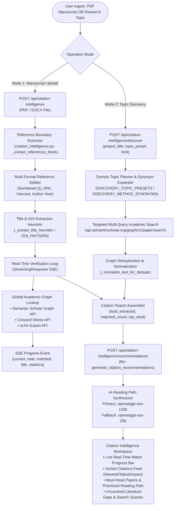

# 🗂 Citation Intelligence — Academic Graph Verification & Strategic Literature Discovery

> **PaperLens AI Citation Intelligence System**: An enterprise-grade reference extraction engine, global academic graph validator, and automated reading roadmap synthesizer. Operates via a dual-mode architecture supporting both empirical manuscript bibliography verification and topic-driven academic graph discovery across Semantic Scholar, Crossref, and arXiv.

---

## 1. Executive Summary & Request Lifecycle

**Citation Intelligence** automates the tedious and error-prone process of extracting, verifying, and analyzing academic bibliographies. It cross-references extracted references against global academic knowledge graphs in real time, flags unverified citations, calculates citation influence, and synthesizes an optimal, prioritized reading roadmap.

### Architecture Flowchart



---

## 2. Dual Operational Modes

### Mode 1: Manuscript Bibliography Verification (`upload`)
- **Use Case**: Upload a PDF or DOCX research paper to audit its reference section, verify citations against peer-reviewed registries, and identify missing/unindexed references.
- **Reference Extraction Pipeline**:
  1. Identifies the reference section boundaries (`"References"`, `"Bibliography"`, `"Works Cited"`) while ignoring appendices, author contributions, and acknowledgments.
  2. Parses individual entries across multiple academic citation styles (Numbered `[1]`, APA `(Author, Year)`, Harvard, Chicago).
  3. Extracts DOIs and titles using heuristic regex patterns (`_TITLE_AFTER_YEAR_PATTERN`, `_QUOTED_TITLE_PATTERN`, `_TITLE_BEFORE_IN_PATTERN`).
  4. Queries Semantic Scholar and Crossref APIs with anonymous fallbacks to prevent rate-limit interruptions.
  5. Emits real-time SSE progress events per reference so users see verification status live.

### Mode 2: Topic-Based Literature Discovery (`discover`)
- **Use Case**: Input a new research topic or project description to discover foundational, highly-cited, and emerging state-of-the-art papers.
- **Query Planning & Synonym Expansion**:
  - Automatically expands technical terms using curated method dictionaries (`gan` $\rightarrow$ `generative adversarial network`, `gnn` $\rightarrow$ `graph neural network`, `vit` $\rightarrow$ `vision transformer`).
  - Supports 6 specialized **Domain Presets**:
    1. `plant_pathology`: Crop disease, leaf blight, agricultural vision.
    2. `agricultural_disease`: Crop health, precision agriculture, disease monitoring.
    3. `medical_imaging`: Radiology, MRI, CT, ultrasound, lesion segmentation.
    4. `medical_diagnosis`: Clinical decision support, risk prediction, diagnostic AI.
    5. `remote_sensing`: Satellite imagery, earth observation, land cover classification.
    6. `climate_earth_observation`: Environmental monitoring, climate forecasting.
  - Formulates multi-angle search queries to ensure comprehensive literature coverage across theoretical foundations and benchmark evaluations.

---

## 3. Graph Analytics & AI Recommendation Engine

Once references are retrieved and matched, [`generate_citation_recommendations`](file:///d:/Edutation(P)/Learning-code/paper_explainer/backend/app/services/llm_sections/generation.py) processes the academic graph into actionable insights:

```
┌────────────────────────────────────────────────────────────────────────┐
│                     VERIFIED CITATION GRAPH                            │
└───────────────────────────────────┬────────────────────────────────────┘
                                    │
       ┌────────────────────────────┼────────────────────────────┐
       ▼                            ▼                            ▼
[Top-Cited Baselines]       [Recent SOTA Papers]        [Unmatched / Gaps]
(Highly Influential Citations, (Emerging Methodologies, (Uncovered Literature,
 Citation Velocity)          Recent Benchmarks)          Missing Seminal Works)
       │                            │                            │
       └────────────────────────────┼────────────────────────────┘
                                    ▼
       [LLM Graph Reasoning: Primary openai/gpt-oss-120b | Fallback gpt-oss-20b]
                                    ▼
       ┌─────────────────────────────────────────────────────────────────┐
       │ 1. Core Paper Focus Synthesis                                   │
       │ 2. Curated Must-Read Papers (High / Medium Priority with Rationale)│
       │ 3. Sequential 4-Stage Reading Path (Foundational → SOTA)        │
       │ 4. Coverage Gaps & Recommended Search Queries                   │
       └─────────────────────────────────────────────────────────────────┘
```

### Recommendation Artifacts
1. **Must-Read Papers**: Identifies the 3–5 most critical papers that form the theoretical foundation of the research domain, with explicit explanations (*"Why Read"*) and priority tags.
2. **Prioritized Reading Path**: Structures a step-by-step sequential reading roadmap:
   - *Phase 1*: Seminal & Theoretical Foundations
   - *Phase 2*: Core Architectural Frameworks
   - *Phase 3*: Dataset Benchmarks & Experimental Standards
   - *Phase 4*: State-of-the-Art Extensions & Recent Advancements
3. **Coverage Gaps**: Highlights missing related work or unaddressed sub-domains that should be included in a rigorous literature review.
4. **Follow-Up Search Queries**: Ready-to-use search strings for downstream academic discovery.

---

## 4. API Reference

### 1. Upload & Stream Manuscript Reference Verification
`POST /api/citation-intelligence`

#### Request (Multipart Form)
- `file`: PDF or DOCX file (up to 25 MB).

#### Server-Sent Events (SSE) Protocol

##### Progress Event
```text
data: {
  "type": "progress",
  "current": 14,
  "total": 45,
  "matched": true,
  "title": "Attention Is All You Need",
  "reference_text": "[14] Vaswani, A., et al. Attention Is All You Need. NeurIPS 2017..."
}
```

##### Completion Event (`type: done`)
```json
{
  "type": "done",
  "total_references_extracted": 45,
  "references_processed": 45,
  "matched_count": 42,
  "missing_count": 3,
  "references": [
    {
      "reference_index": 1,
      "reference_text": "[1] Smith et al. Equivariant GNNs...",
      "matched": true,
      "paper_id": "649def34f8be52c8b66281af98ae772c99380b",
      "title": "SE(3)-Equivariant Graph Transformers",
      "year": 2023,
      "citation_count": 142,
      "url": "https://www.semanticscholar.org/paper/...",
      "venue": "ICLR",
      "authors": ["Alice Smith", "Bob Jones"]
    }
  ],
  "top_cited": [...]
}
```

---

### 2. Topic-Based Academic Graph Discovery
`POST /api/citation-intelligence/discover`

#### Request Body
```json
{
  "project_title": "Equivariant 3D Graph Neural Networks for Protein Binding",
  "basic_details": "Focus on molecular conformation dynamics and binding affinity",
  "limit": 35,
  "topic_preset": "auto"
}
```

#### Response (`200 OK`)
```json
{
  "total_references_extracted": 35,
  "references_processed": 35,
  "matched_count": 35,
  "missing_count": 0,
  "project_title": "Equivariant 3D Graph Neural Networks for Protein Binding",
  "discovery_profile": {
    "intent_summary": "Research focused on Equivariant 3D Graph Neural Networks for Protein Binding",
    "core_terms": ["equivariant graph neural networks", "protein ligand binding"],
    "topic_preset": "medical_imaging"
  },
  "references": [...],
  "top_cited": [...]
}
```

---

### 3. Generate Strategic Reading Recommendations
`POST /api/citation-intelligence/recommendations`

#### Request Body
```json
{
  "paper_context": "Study on equivariant molecular graphs and binding affinity prediction",
  "top_cited": [...],
  "missing_references": [...],
  "recommendation_mode": "discover",
  "project_title": "Equivariant 3D Graph Neural Networks for Protein Binding",
  "basic_details": ""
}
```

#### Response (`200 OK`)
```json
{
  "paper_focus": "The research focuses on SE(3)-equivariant geometric deep learning architectures for molecular binding affinity estimation.",
  "must_read": [
    {
      "title": "SE(3)-Transformers: 3D Roto-Translation Invariant Attention Networks",
      "why_read": "Establishes the mathematical formulation of equivariant message passing for 3D point clouds.",
      "priority": "high"
    }
  ],
  "reading_path": [
    "Step 1: Read 'SE(3)-Transformers' to understand roto-translation equivariance.",
    "Step 2: Read 'PDBbind v2020 Benchmark' for dataset evaluation baselines.",
    "Step 3: Read 'Equivariant Graph Transformers' for state-of-the-art affinity benchmarks."
  ],
  "coverage_gaps": [
    "Limited evaluation on induced-fit allosteric protein deformation under high temperature."
  ],
  "next_search_queries": [
    "equivariant graph neural networks protein pocket dynamics",
    "molecular dynamics SE(3) allosteric binding benchmark"
  ]
}
```

---

## 5. UI/UX Citation Intelligence Workspace

The interface ([`CitationIntelligence.tsx`](file:///d:/Edutation(P)/Learning-code/paper_explainer/frontend/src/pages/CitationIntelligence.tsx)) provides a high-density, scientific workspace:

```
┌────────────────────────────────────────────────────────────────────────────────────────┐
│ [Tab: Upload Manuscript]  [Tab: Discover by Topic]        Sort: [Highest Citations ▼]  │
├────────────────────────────────────────────────────────────────────────────────────────┤
│ Real-Time Verification Progress: [██████████████████████████░░░] 42/45 Verified (93%)  │
├───────────────────────────────────────────┬────────────────────────────────────────────┤
│ LEFT PANEL: Verified Reference Feed       │ RIGHT PANEL: Strategic Reading Plan        │
│                                           │                                            │
│ [Card 1] Attention Is All You Need        │ 🧠 Strategic Recommendations               │
│ • Citations: 124,512  • Year: 2017        │ Focus: Geometric Deep Learning for Binding │
│ • Authors: Vaswani et al. • Venue: NeurIPS│                                            │
│ • [Semantic Scholar ↗] [Open Access PDF]  │ 📚 Must-Read Papers (High Priority)        │
│                                           │ 1. SE(3)-Transformers (NeurIPS 2020)       │
│ [Card 2] Equivariant Graph Transformers   │    Why: Foundational 3D attention math.    │
│ • Citations: 342      • Year: 2023        │                                            │
│ • Authors: Smith et al.   • Venue: ICLR   │ 🗺️ Prioritized Reading Path                │
│ • [Semantic Scholar ↗] [arXiv ↗]          │ › Phase 1: Seminal Geometric Math          │
│                                           │ › Phase 2: PDBbind Baseline Benchmarking   │
│ [Search Bar: Filter by author/venue]      │ › Phase 3: SOTA Equivariant Extensions     │
└───────────────────────────────────────────┴────────────────────────────────────────────┘
```

### Key UI Features
- **Real-Time Progress Visualization**: Live animated progress bar with streaming match indicators.
- **Multi-Dimensional Sorting**: Instant re-sorting by Highest Citations, Lowest Citations, Newest Year, or Oldest Year.
- **Direct Scholar Links**: One-click deep links to Semantic Scholar profiles, DOIs, and Open Access PDFs.
- **AI Recommendation Drawer**: Interactive Must-Read cards and step-by-step reading roadmap.

---

## 6. Quality Assurance & Verification

To verify the Citation Intelligence extraction, academic graph lookups, and AI recommendations:

```bash
# 1. Test citation intelligence discovery and topic expansion
python backend/test_agent_architecture.py

# 2. Test structured outputs and recommendation schemas
python backend/test_structured_outputs.py

# 3. Verify frontend build
cd frontend && npm run build
```
