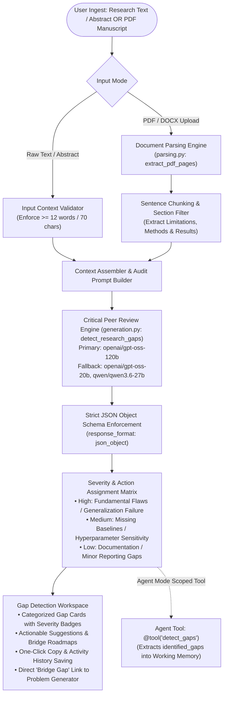

# 🔍 Gap Detection — Automated Research Audit & Critical Vulnerability Analysis

> **PaperLens AI Research Gap Engine**: An enterprise-grade peer-review auditing system that dissects academic manuscripts, abstracts, and experimental proposals. Detects hidden assumptions, missing baseline comparisons, out-of-distribution vulnerabilities, and computational bottlenecks, assigning categorized severity ratings alongside concrete, actionable remedies.

---

## 1. Executive Summary & Request Lifecycle

**Gap Detection** acts as an automated, highly critical peer reviewer. It evaluates research text or uploaded manuscripts against rigorous academic standards, isolating methodological weaknesses and formulating actionable research directions to resolve them.

### Architecture Flowchart



---

## 2. Core Architectural Components

### A. Input Context Validation & Quality Gates
To prevent ungrounded hallucinations on underspecified queries (e.g. typing a 3-word title like *"GNN drug discovery"*), the frontend and API validate input density:
- **Minimum Context Threshold**: Requires at least **12 words / 70 characters** of abstract, methodology, or experimental plan text.
- **Document Chunk Filtering**: When a full PDF is uploaded, the parser isolates methodology, results, and discussion sections to keep the prompt laser-focused on empirical rigor.

### B. Severity Classification Matrix
Every detected research gap is categorized into a standardized severity tier:

| Severity Tier | Severity Badge | Risk Description | Example Identified Issue |
| :--- | :--- | :--- | :--- |
| **High Severity** | `Destructive Red` | Fundamental methodological flaws, out-of-distribution evaluation failures, or unaddressed theoretical bottlenecks that invalidate empirical claims. | *“No out-of-distribution evaluation under real-world domain shift; validation relies solely on random cross-validation on homogeneous lab data.”* |
| **Medium Severity** | `Accent Amber` | Missing competitive SOTA baselines, uncalibrated hyperparameter search, or lack of ablation studies on key architectural components. | *“Ablation study omits the equivariant attention mechanism; unclear if performance gains stem from increased parameter count or structural equivariance.”* |
| **Low Severity** | `Secondary Slate` | Minor reporting omissions, unstandardized metric reporting, or incomplete reproducible benchmark specifications. | *“Inference latency reported without hardware batch size or precision details.”* |

### C. Actionable Bridge Suggestions
Unlike passive grammar or style checkers, the Gap Detection engine pairs every detected vulnerability with a **falsifiable, concrete research remedy** (`suggestion`). These suggestions directly feed into the **Problem Generator** and **Experiment Planner** to design follow-up experimental roadmaps.

---

## 3. Scoped Agent Mode Tool Integration

Gap Detection is fully registered as a scoped tool in the **Autonomous Agent Mode** orchestrator ([`tools.py`](file:///d:/Edutation(P)/Learning-code/paper_explainer/backend/app/services/agents/tools.py)):

```python
@tool("detect_gaps", "Identify unexplored research gaps, limitations, and open challenges in a domain or uploaded paper")
async def detect_gaps(domain: str = "", paper_id: str = "", **kwargs) -> Dict[str, Any]:
    # Extracts identified_gaps into Agent Task Working Memory:
    # {"identified_gaps": [{"gap": "...", "description": "...", "opportunity": "..."}]}
```

When called inside an autonomous research loop, its output is automatically passed forward to Tool 2 (`generate_problem`) and Tool 3 (`plan_experiment`), guaranteeing that generated research proposals address the exact vulnerabilities uncovered during the gap audit.

---

## 4. API Reference

### 1. Detect Research Gaps in Text or Uploaded Paper
`POST /api/detect-gaps`

#### Request (Multipart Form)
- `text` *(optional)*: Raw text, abstract, or experimental plan.
- `file` *(optional)*: PDF or DOCX manuscript file.

#### Response (`200 OK`)
```json
{
  "gaps": [
    {
      "title": "Lack of 3D Conformational Dynamics in 2D Assays",
      "explanation": "Current screening pipelines evaluate static 2D topological graphs and fail when protein pockets undergo induced fit deformation under binding stress.",
      "severity": "high",
      "suggestion": "Incorporate molecular dynamics trajectory tensors into equivariant graph convolutions to evaluate allosteric pocket flexibility."
    },
    {
      "title": "Absence of Out-of-Distribution Scaffold Generalization",
      "explanation": "The benchmark uses random split validation, which leads to scaffold leakage and artificially inflated accuracy scores.",
      "severity": "high",
      "suggestion": "Evaluate the model using Bemis-Murcko scaffold split benchmarks across MoleculeNet datasets."
    },
    {
      "title": "Unquantified Inference Latency on Edge Hardware",
      "explanation": "High computational complexity of dense point cloud generation is not benchmarked for real-time high-throughput screening.",
      "severity": "medium",
      "suggestion": "Benchmark inference throughput (samples/sec) across NVIDIA TensorRT and ONNX Runtime backends."
    }
  ]
}
```

---

## 5. UI/UX Gap Detection Workspace

The interface ([`GapDetection.tsx`](file:///d:/Edutation(P)/Learning-code/paper_explainer/frontend/src/pages/GapDetection.tsx)) provides a high-density, scientific auditing canvas:

```
┌────────────────────────────────────────────────────────────────────────────────────────┐
│ [Tab: Paste Plan Text]  [Tab: Upload Paper File]                                      │
├────────────────────────────────────────────────────────────────────────────────────────┤
│ ┌────────────────────────────────────────────────────────────────────────────────────┐ │
│ │ Research Summary / Plan Context:                                                   │ │
│ │ "We propose an SE(3)-equivariant transformer for molecular binding..."             │ │
│ └────────────────────────────────────────────────────────────────────────────────────┘ │
│                                                      [⚡ Detect Research Gaps]        │
├────────────────────────────────────────────────────────────────────────────────────────┤
│ IDENTIFIED RESEARCH GAPS (3 FINDINGS)                       [Copy All] [Save Report]   │
├────────────────────────────────────────────────────────────────────────────────────────┤
│ [Card 1] Lack of 3D Conformational Dynamics                    [High Severity Badge]   │
│ • Weakness: Static 2D topological representations fail on allosteric deformation.      │
│ • Remedy:   Incorporate MD trajectory tensors into equivariant graph convolutions.     │
│ • [💡 Formulate Problem Statement]  [🧪 Plan Experiment Roadmap]                       │
│                                                                                        │
│ [Card 2] Absence of Out-of-Distribution Scaffold Generalization [High Severity Badge] │
│ • Weakness: Random split validation causes scaffold leakage.                           │
│ • Remedy:   Evaluate on Bemis-Murcko scaffold splits across MoleculeNet assays.        │
│                                                                                        │
│ [Card 3] Unquantified Inference Latency on Edge Hardware      [Medium Severity Badge]  │
│ • Weakness: Dense point cloud generation computational overhead unmeasured.            │
│ • Remedy:   Benchmark samples/sec on ONNX Runtime and TensorRT.                        │
└────────────────────────────────────────────────────────────────────────────────────────┘
```

### Key UI Features
- **Dual Input Modes**: Seamlessly toggle between raw abstract/plan text and PDF manuscript uploads.
- **Color-Coded Severity Signals**: Destructive red badges for high-risk vulnerabilities, amber for medium, and slate for minor reporting gaps.
- **Workflow Bridges**: Direct action buttons to jump from an identified gap straight into the **Problem Generator** or **Experiment Planner**.
- **Export & History**: 1-click clipboard copy formatted for academic proposals, with persistent saving to user activity history.

---

## 6. Quality Assurance & Verification

To verify the Gap Detection models, schemas, and API handlers:

```bash
# 1. Test Gap Detection JSON schema validation & fallback routing
python backend/test_structured_outputs.py

# 2. Test Agent Mode gap detection tool integration & working memory
python backend/test_structured_entity_extraction.py

# 3. Verify frontend compilation
cd frontend && npm run build
```
